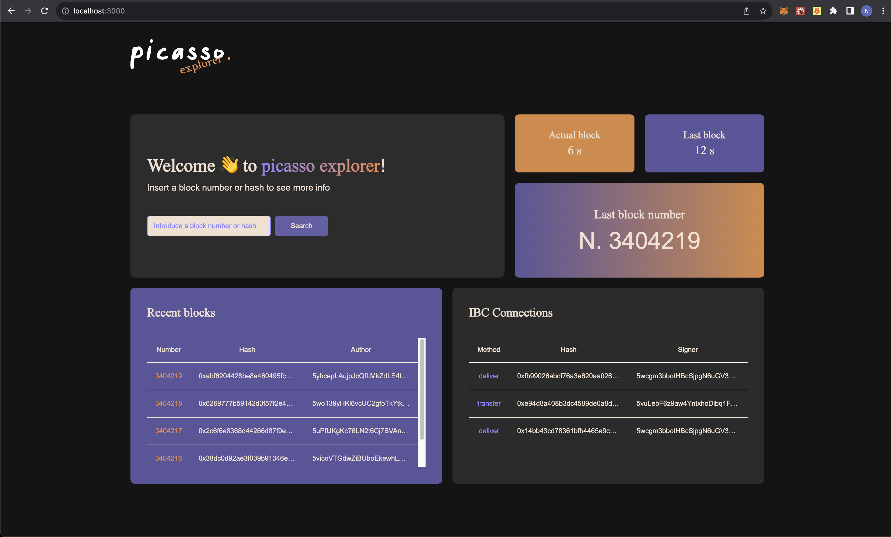

   

## Picasso Explorer

**Picasso Explorer** is an app built with Next.js, designed to empower users to seamlessly navigate the **Picasso blockchain**. This user-friendly platform offers a wealth of valuable information, allowing individuals to explore Picasso blockchain blocks with ease and efficiency

## Process

The initial steps in crafting this project began with extracting the core colors and fonts from Composable and Picasso. Following this, I embarked on creating the first schematic/prototype using Figma. Subsequently, I integrated the chosen color palette and further refined the design elements (you can view the complete Figma design [here](https://www.figma.com/file/6WFiZ7a0v7UXPtPLwiNcZW/Picasso-explorer?type=design&node-id=0%3A1&mode=design&t=voLbleZiiGMWtsCx-1)). With the design foundation in place, I was ready to kickstart the development process. I initiated a new Next.js project, configured the environment, and delved into the coding phase.

## Technology

I opted to leverage Next.js to harness the strengths of both Client Side Rendering and Server Side Rendering in the Picasso Explorer project.

Client Side Rendering is employed throughout the entire app, including the main page, facilitated by a contextProvider that maintains the connection. This is crucial as the main page keeps a subscription open, via polkadotjs, to receive real-time updates on new blocks and ICB events in the Picasso blockchain.

On the other hand, Server Side Rendering is implemented in the dedicated block pages. This ensures that when a user shares a specific block link, the user experience is significantly enhanced, eliminating the need to wait for the connection and subsequent data fetch. Additionally, as mentioned earlier, a connection is established through the contextProvider, so that if the user wishes to perform a new search or return to the main page, the process is expedited. All of this is seamlessly orchestrated using React Query.

**List of technologies:**

- [x] Typescript
- [x] Nextjs
- [x] React Query
- [x] shadcn/ui

## Try the app

You can check the APP following [this link](https://picasso-explorer.vercel.app/)!

or

Clone the project

    git clone git@github.com:NicolasBiondini/Picasso-Explorer.git

    cd picasso-explorer

Install dependencies

    npm install

Run the project

    npm run dev

## Images

